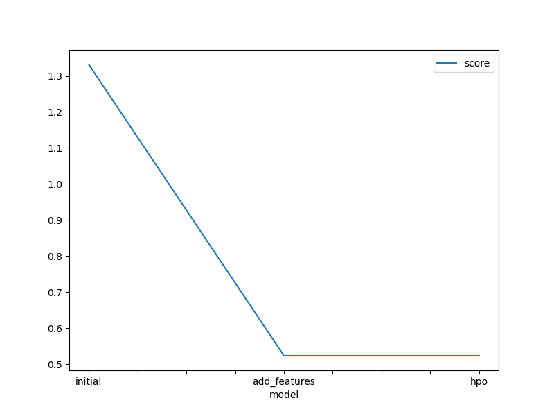
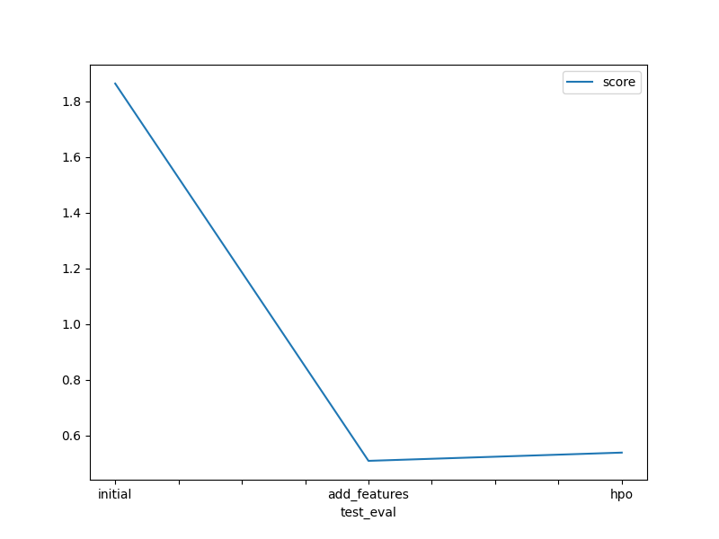

# Report: Predict Bike Sharing Demand with AutoGluon Solution
#### NEDJAOUI Ihssane

## Initial Training
### What did you realize when you tried to submit your predictions? What changes were needed to the output of the predictor to submit your results?
If the predictions values contains negative or null values i couldn't submit my results

### What was the top ranked model that performed?
The top ranked model  was the model with added features without hyperparameters optimization

## Exploratory data analysis and feature creation
### What did the exploratory analysis find and how did you add additional features?
The exploratory data analysis found that acually if we can seperate datetime features into more than one features we can have better results, so the additional feature is the hour extracted from the datetime feature

### How much better did your model preform after adding additional features and why do you think that is?
My model improved much after adding additional features, the reason is actually we added more features to the model, and the added feature contain informations that made the model much better.

## Hyper parameter tuning
### How much better did your model preform after trying different hyper parameters?
After trying different hyperparameters, my model improved a little bit (the loss was reduced by 0.01) for a set of hyperparameters combination

### If you were given more time with this dataset, where do you think you would spend more time?
If I was given more time with this data set i will spend more time on feature engineering, since it proved that it improved the model much better than hyperparameters optimization.

### Create a table with the models you ran, the hyperparameters modified, and the kaggle score.
|model|hpo1|hpo2|hpo3|score|
|--|--|--|--|--|
|initial|{'criterion': 'gini', 'n_estimators': 50, 'max_depth': 10}|{'criterion': 'entropy', 'n_estimators': 100, 'max_depth': 8}|{'criterion': 'gini', 'n_estimators': 75, 'min_samples_split': 5}|1.33184|
|add_features|{'criterion': 'gini', 'n_estimators': 50, 'max_depth': 10}|{'criterion': 'entropy', 'n_estimators': 100, 'max_depth': 8}|{'criterion': 'gini', 'n_estimators': 75, 'min_samples_split': 5}|0.52311|
|hpo|{'criterion': 'entropy', 'n_estimators': 150, 'max_features': 0.8}|{'criterion': 'gini', 'n_estimators': 80, 'min_samples_leaf': 3}|{'criterion': 'entropy', 'n_estimators': 120, 'max_depth': 12, 'min_samples_split': 10}|0.52311|
 
     
     

### Create a line plot showing the top model score for the three (or more) training runs during the project.

TODO: Replace the image below with your own.

### Create a line plot showing the top kaggle score for the three (or more) prediction submissions during the project.

TODO: Replace the image below with your own.

## Summary
The results don't chnage that much between the training and the prediction phase except for hop in the prediction the loss increased a little bit which ensure the model isn't overfitting.